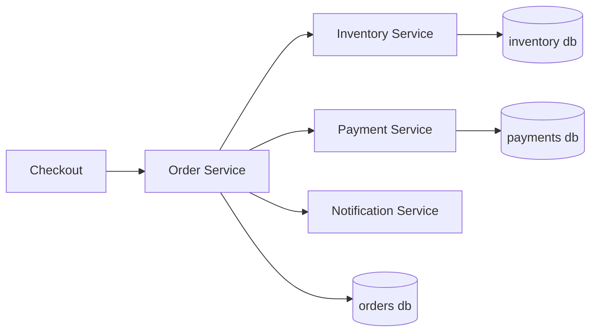
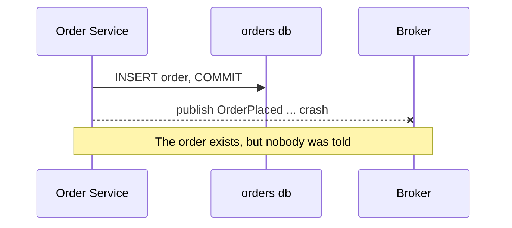
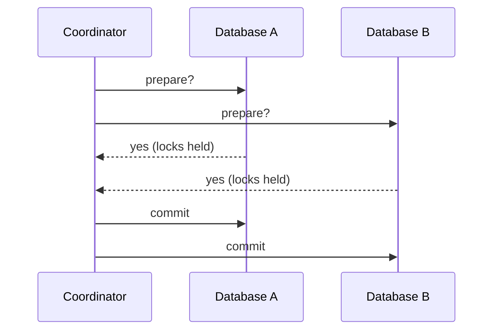
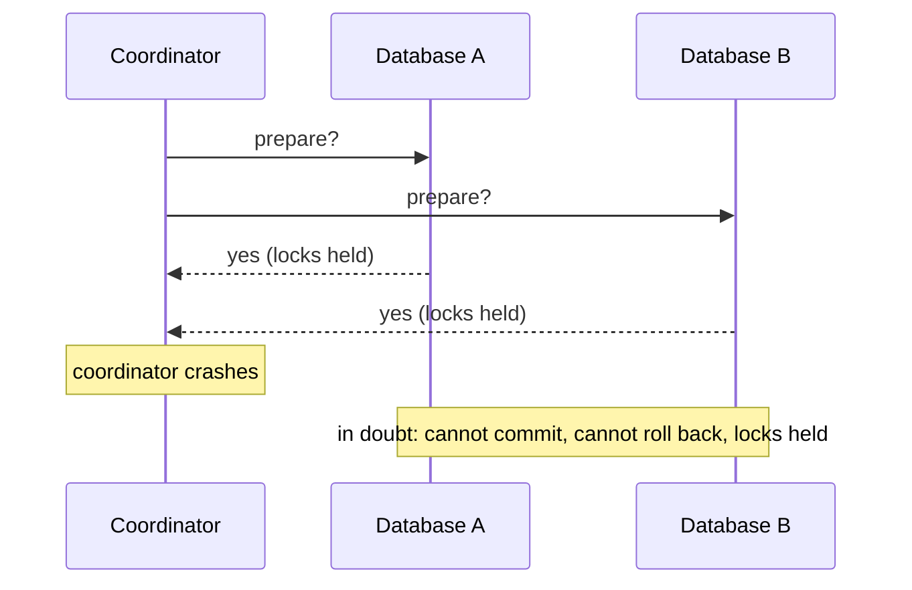
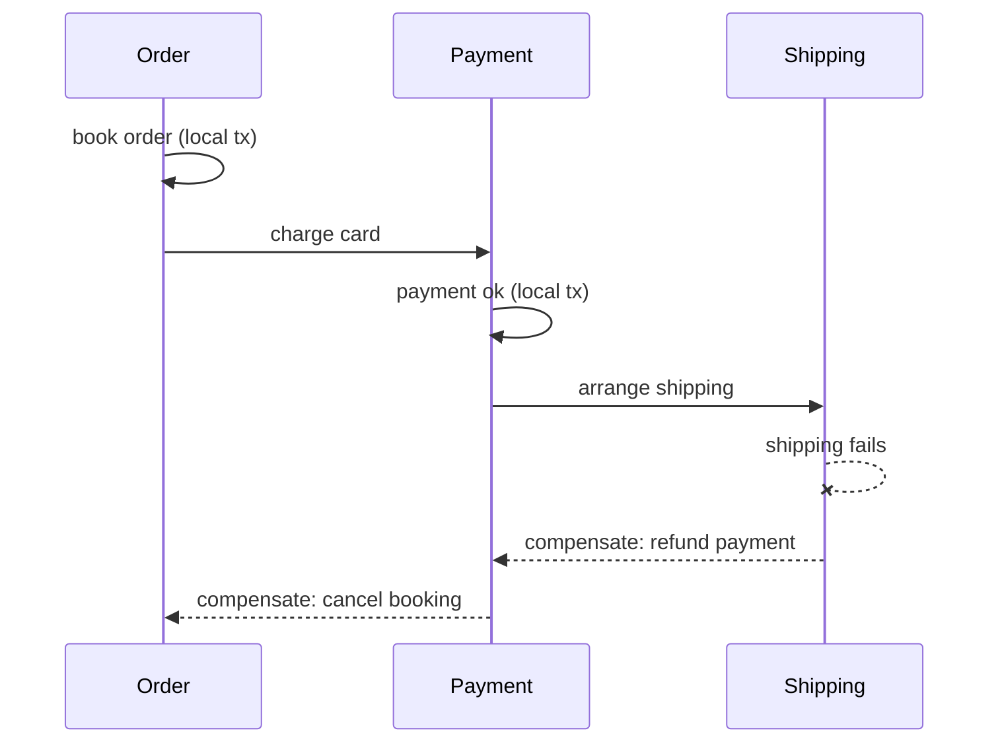
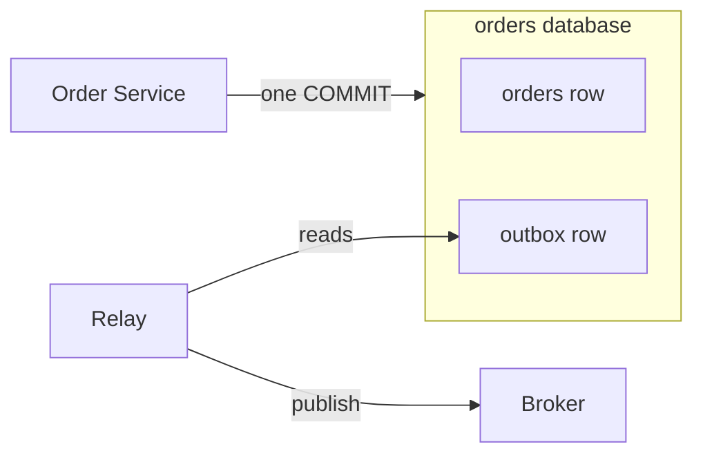
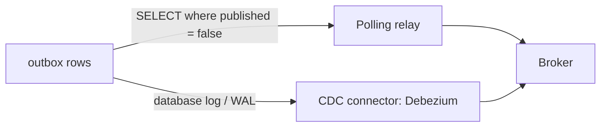
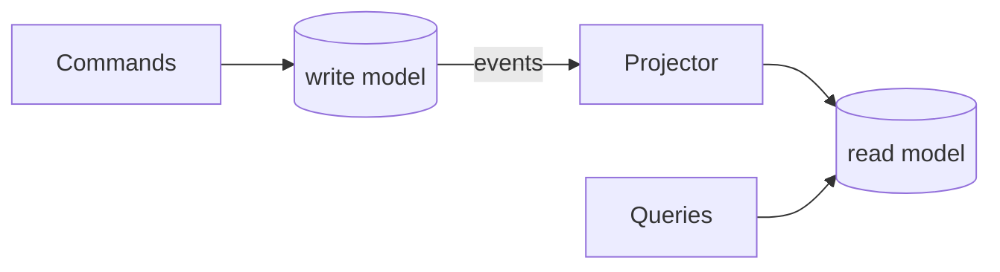
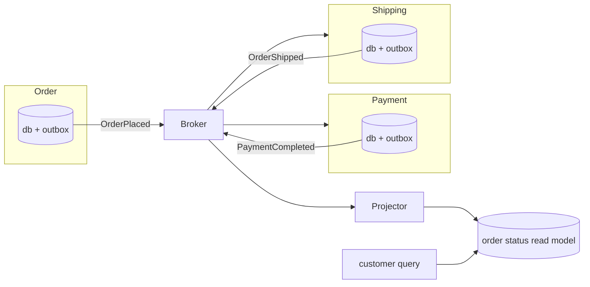

<!-- _class: title -->
<!-- _transition: coverflow 0.7s -->

<!-- deck:title:start -->

###### Saga, Transactional Outbox, and CQRS

# Distributed Transactions Without 2PC

Why two-phase commit is often a poor fit for modern distributed systems, and how Saga, Transactional Outbox, and CQRS help services coordinate safely.

###### Gaurav Agarwal

<!-- deck:title:end -->

<!--
Welcome everyone, let the room fill up. Housekeeping: session is about 90 minutes, it is discussion-heavy, interrupt me any time in chat or on mic. Ask who has worked with microservices in production; calibrate depth from the answers.
-->

---

<!-- _class: cols-photo -->

<div class="cols">
<div class="col-media">


</div>
<div class="col-body">

## Gaurav Agarwal

Software Engineer & Product Developer

Director of Engineering & Founder @ https://codermana.com

ex-Tarka Labs, ex-BrowserStack, ex-ThoughtWorks

</div>
</div>

<!--
Thirty seconds max. One line on background, then move on. Mention the distributed design patterns training this material comes from; the repo link is at the end.
-->

---

# Agenda

1. Why distributed transactions are hard
2. The promise and pain of 2PC
3. Saga: coordination through compensation
4. Transactional Outbox: reliable announcements
5. Putting the patterns together (with CQRS)
6. Discussion and Q&A

> One argument, four patterns. Each section builds on the previous one.

<!--
Set the frame: this is one argument told through four patterns, not a pattern catalog. Sections 3 to 5 each answer a problem the previous section exposes. Tell them the code is real and runnable, and we will run some of it live.
-->

---

<!-- _class: section -->

###### Part 1

# Why distributed transactions are hard

<!--
Timing check: aim to be here within 5 minutes of the start.
-->

---

## Inside one database, life is good

* One `BEGIN ... COMMIT`, one outcome
* Atomicity and isolation come for free
* Partial failure is invisible: the change either happened or it did not

<!--
Anchor the shared intuition first. Everyone in the room trusts a local transaction without thinking about it. Say explicitly: hold on to this feeling, because the rest of the talk is about what happens when you lose it.
-->

---

## The running example: placing an order



<!--
Introduce the example we will reuse all session: placing an order touches inventory, payment, and notification, and every service owns its own database. No shared database, no shared transaction. Ask: what happens if payment succeeds but inventory reservation fails?
-->

---

<!-- _class: cards -->

# What breaks across services

| Partial failure | Retries and duplicates | No global lock |
| --- | --- | --- |
| Any call can fail after doing its work. The caller cannot tell "failed" from "succeeded but the reply got lost". | The standard cure for failure is retry. Retries mean the same request can arrive twice, so every effect can happen twice. | Nothing spans the services to keep them consistent while the workflow is in flight. Every service sees a different moment in time. |

<!--
Spend a moment on the middle card: retries are not an edge case, they are the default behavior of every HTTP client, queue, and service mesh. Duplicates are a feature of reliable systems, not a bug. This plants idempotency, which returns in part 5.
-->

---

## The dual-write problem



<!--
This is the single most important failure in the talk; the outbox section exists to fix it. Two systems, two writes, no transaction across them. Whichever order you do the writes in, a crash between them leaves the system lying to itself. Ask the room: does publishing first fix it? No, then you can announce an order that was never saved.
-->

---

<!-- _class: exercise -->

# Exercise: spot the failure

The checkout handler does, in this order:

1. `INSERT INTO orders ...` and commit
2. Publish `OrderPlaced` to the broker
3. Call the payment service over HTTP

Where can this leave the system inconsistent?

<!--
Give the room two minutes, answers in chat. Expected finds: crash between 1 and 2 (order saved, never announced), crash between 2 and 3 (event out, payment never attempted), payment timeout at 3 (did it charge or not?), and a retry of the whole handler creating a second order. Every pattern in this talk maps to one of these answers; refer back to them by name later.
-->

---

<!-- _class: quote -->

> Local transactions are not the hard part. **Telling everyone else what happened** is.

<!--
This is the one sentence of the talk. Pause on it. Everything that follows is a way to make either the local commit or the announcement reliable, and the trick is refusing to smear one transaction across the network.
-->

---

<!-- _class: section -->

###### Part 2

# The promise and pain of 2PC

<!--
Frame it fairly: 2PC is the obvious, principled answer to the previous section. We take it seriously before we criticize it.
-->

---

<!-- _class: cards -->

# What two-phase commit promises

| One atomic outcome | A coordinator | A long pedigree |
| --- | --- | --- |
| All participants commit, or all roll back. The workflow gets the same guarantee a local transaction has. | A coordinator asks everyone to *prepare*, collects votes, then announces *commit* or *rollback*. | Formalized in the 1980s, standardized as XA. Databases, queues, and app servers have spoken it for decades. |

<!--
On paper this is exactly what part 1 asked for: extend BEGIN and COMMIT across machines. Mention XA so the term is on the table; older audience members will have used it via JTA or MSDTC.
-->

---

## The happy path



<!--
Walk it slowly, this diagram carries the section. Emphasize what "yes" costs: from the moment a participant votes yes, it holds locks and has surrendered the right to decide. It cannot commit, cannot roll back, until the coordinator speaks again.
-->

---

<!-- _class: code -->

## The participants

<!-- snippet: examples/03-data-management-single/03_2pc.go#participant -->

```go
type Participant interface {
	Prepare() bool
	Commit() bool
	Rollback() bool
}
```

> Real participants are resource managers: databases, queues, anything that can vote.

<!--
Switch to the editor if the projection is small. The interface is the whole protocol contract: prepare is the vote, commit and rollback are the coordinator's verdict. DatabaseA and DatabaseB just print, which is exactly enough to see the protocol shape.
-->

---

<!-- _class: code -->

## Phase 1: collect the votes

<!-- snippet: examples/03-data-management-single/03_2pc.go#phase1 -->

```go
// Phase 1: Prepare
allReady := true
for _, participant := range c.participants {
	if !participant.Prepare() {
		allReady = false
		break
	}
}
```

> A single "no", or a single timeout, dooms the whole transaction.

<!--
Point out the loop is sequential and blocking, and a production coordinator has the same structure with better plumbing. Ask: what does the coordinator do if a participant simply never answers? It waits. That question is the next slide.
-->

---

<!-- _class: code -->

## Phase 2: announce the verdict

<!-- snippet: examples/03-data-management-single/03_2pc.go#phase2 -->

```go
// Phase 2: Commit or Rollback
if allReady {
	fmt.Println("All participants are ready, committing.")
	for _, participant := range c.participants {
		if !participant.Commit() {
			participant.Rollback()
		}
	}
} else {
	fmt.Println("Participants are not ready, rolling back.")
	for _, participant := range c.participants {
		participant.Rollback()
	}
}
```

<!--
Live run: go run examples/03-data-management-single/03_2pc.go. Both databases prepare, both commit. Then change DatabaseB.Prepare to return false and run again to show the global rollback. The demo takes under a minute and makes the protocol concrete.
-->

---

<!-- _class: cards -->

# Where it hurts

| Blocking by design | Coupled availability | Wrong trust model |
| --- | --- | --- |
| Prepared participants hold locks while they wait. Throughput is hostage to the slowest participant. | The workflow is only as available as the coordinator *and* every participant, multiplied together. | XA assumes participants that speak the protocol. Your REST and gRPC services do not, and bolting it on couples their deployments. |

<!--
The third card is the one microservice audiences need most: 2PC is not wrong, it is a protocol for resource managers inside one trust domain, and independent services are neither. Availability math example: five participants at 99.9 percent each compound to roughly 99.4 percent for every workflow.
-->

---

## The killer failure: coordinator dies after prepare



<!--
This is the scenario that earned 2PC its reputation. The participants did everything right and are now stuck: committing unilaterally risks diverging from the verdict, rolling back risks the same. In practice an operator resolves in-doubt transactions by hand. Let that sink in before offering the Spanner nuance next.
-->

---

## Then why does Google Spanner use 2PC?

* Each "participant" is a **Paxos group**, not a single machine
* The coordinator's state is replicated too: a crash does not strand anyone
* One operator, one trust domain, engineered clocks

> The pain is not the protocol. It is **fragile coordinators and participants**.

<!--
This nuance keeps the talk honest. Spanner runs 2PC over consensus groups, so the classic failure mode (a single dead box stranding everyone) does not exist. The lesson: 2PC over reliable, replicated participants inside one system is fine. 2PC across independently owned services is where the assumptions collapse.
-->

---

<!-- _class: caveat -->

## The working rule

Between microservices you own separately: avoid 2PC. The rest of this talk is what to do instead.

> Caveat: inside one trust domain, with real XA support and short-lived transactions, 2PC remains a legitimate tool. Your database uses it internally more than you think.

<!--
Anticipated question: "so is 2PC dead?" Answer: no, it moved down the stack. It lives inside databases, inside Spanner-like systems, between a broker and a database in the same operational domain. What died is stretching it across independently deployed services. Park deeper debate for the discussion section.
-->

---

<!-- _class: section -->

###### Part 3

# Saga: coordination through compensation

<!--
Timing check: roughly a third of the way through the clock. Bridge: if we refuse one global transaction, we must break the workflow into pieces that each commit locally. That is a saga.
-->

---

## A saga is a sequence of local transactions

* Each step commits **in its own service**, immediately and for real
* Each step has a **compensating action** that semantically undoes it
* If step N fails: run compensations N-1 down to 1, in reverse

<!--
Credit the 1987 Garcia-Molina and Salem paper; the idea predates microservices by decades. Stress "semantically undoes": there is no rollback of a committed transaction, only a new transaction that reverses the business effect. A refund is not an un-charge.
-->

---

## The order saga, with a failure



<!--
Walk forward first, then the reverse wave of compensations. Point out every box on the diagonal is a committed local transaction; the world saw those states. A customer refreshing at the wrong moment sees a paid order that later becomes cancelled. That visibility is the price of no isolation, and it comes back two slides from now.
-->

---

<!-- _class: code code-tight -->

## The steps

<!-- snippet: examples/03-data-management-single/04_saga.go#steps -->

```go
func OrderBooking() error {
	fmt.Println("Booking order...")
	return nil
}

func Payment() error {
	fmt.Println("Processing payment...")
	// return fmt.Errorf("card declined") // uncomment to watch compensations run
	return nil
}

func Shipping() error {
	fmt.Println("Shipping order...")
	return nil
}
```

<!--
Each function stands in for a whole service call that commits its own transaction. The commented line in Payment is the demo switch; leave it alone for now, we flip it in two slides.
-->

---

<!-- _class: code code-tight -->

## The compensations

<!-- snippet: examples/03-data-management-single/04_saga.go#compensations -->

```go
// compensations[i] undoes steps[i]: a semantic undo, not a database rollback
func CancelOrderBooking() error {
	fmt.Println("Cancelling order booking...")
	return nil
}

func CancelPayment() error {
	fmt.Println("Refunding payment...")
	return nil
}

func CancelShipping() error {
	fmt.Println("Cancelling shipping...")
	return nil
}
```

<!--
The index pairing is the contract: compensations[i] undoes steps[i]. Ask the room what CancelPayment really is in production: a refund, which can itself fail, be duplicated, or arrive after the customer called their bank. Compensations are business operations with all the same failure modes.
-->

---

<!-- _class: code -->

## The runner

<!-- snippet: examples/03-data-management-single/04_saga.go#run-saga -->

```go
func RunSaga(steps []Step, compensations []Step) error {
	for i, step := range steps {
		err := step()
		if err != nil {
			fmt.Println("Error occurred, starting compensations...")
			// Execute compensating actions in reverse order
			for j := i - 1; j >= 0; j-- {
				compensations[j]()
			}
			return err
		}
	}
	return nil
}
```

<!--
Live demo, the centerpiece of this section. First: go run examples/03-data-management-single/04_saga.go, clean run. Then uncomment the card declined line in Payment and run again: booking happens, payment fails, and only CancelOrderBooking runs, in reverse order. Point at j := i - 1: the failed step compensates nothing, only completed steps are undone. Re-comment the line afterward.
-->

---

<!-- _class: cards -->

# Who drives the saga?

| Orchestration | Choreography |
| --- | --- |
| One orchestrator calls each step and decides what happens on failure. The workflow is explicit in one place, easy to read and test, but the orchestrator is a coupling point. | Each service reacts to the previous service's events. No central brain, loose coupling, but the workflow exists only as an emergent property. Nobody can point at it. |

<!--
Our RunSaga is a tiny orchestrator. Rule of thumb: choreography reads well at 2 or 3 steps, and turns into archaeology beyond that; orchestration scales with workflow complexity. Discussion prompt: which one do their teams run today, and did they choose it on purpose?
-->

---

<!-- _class: cards -->

# Where sagas get tricky

| Compensations can fail | Retry storms | No isolation |
| --- | --- | --- |
| The refund can bounce. Then you retry it, park it in a dead-letter queue, or page a human. There is no deeper fallback. | Steps time out, callers retry, and one slow service turns into a thundering herd of half-run sagas. | Other transactions see intermediate states. The paid-then-cancelled order is visible to anyone who looks. |

<!--
Anticipated question: "what if the compensation fails?" Be honest: you retry with backoff, then escalate to humans; that is what the countermeasures literature amounts to. The no-isolation card sets up part 5, where read models give us a place to be honest with users about in-flight state.
-->

---

<!-- _class: quote -->

> Each saga step commits locally, then **announces itself** with an event. So everything rests on one question: can you make that announcement **reliable**?

<!--
The bridge slide. A saga is only as sound as the events that drive it from step to step, and slide 8 already showed the announcement is exactly what a crash eats. Which is why the next pattern exists.
-->

---

<!-- _class: section -->

###### Part 4

# Transactional Outbox

<!--
Timing check: about halfway. This section is the most immediately applicable pattern in the talk; most teams can adopt it this quarter without an architecture rewrite.
-->

---

<!-- _class: quote -->

> The dual write, one more time: commit the row, crash before the publish, and the saga's nervous system goes silent.

<!--
Deliberately repeat slide 8, the exercise answer number one. Repetition is the point: the audience should recognize the dual-write problem on sight by now. The fix is almost embarrassingly simple.
-->

---

## The pattern: one database, one transaction



<!--
The whole trick in one sentence: do not write to two systems, write the event into the same database as the data, in the same transaction. The outbox row and the order row commit or roll back together. A separate relay moves outbox rows to the broker afterward, and it can crash and retry freely because the truth is safely in the database.
-->

---

<!-- _class: code code-tight -->

## The models

<!-- snippet: examples/04-data-management-multiple/03_transactional_outbox.go#models -->

```go
// Order and Outbox event structs
type Order struct {
	ID       uint    `json:"id"`
	Customer string  `json:"customer"`
	Total    float64 `json:"total"`
}

type OutboxEvent struct {
	ID        uint   `json:"id"`
	EventType string `json:"event_type"`
	OrderID   uint   `json:"order_id"`
	Published bool   `json:"published"`
}
```

> The outbox is just a table. No new infrastructure on the write path.

<!--
Emphasize how boring this is: the event is a row. Published is the relay's bookmark. In production you would add a payload column with the serialized event and a created_at for ordering, but the shape is this shape.
-->

---

<!-- _class: code code-tight -->

## The atomic write

<!-- snippet: examples/04-data-management-multiple/03_transactional_outbox.go#atomic-write -->

```go
func createOrderWithEvent(db *gorm.DB, order Order) {
	tx := db.Begin()

	if err := tx.Create(&order).Error; err != nil {
		tx.Rollback()
		log.Fatal("Error creating order:", err)
	}

	event := OutboxEvent{EventType: "ORDER_PLACED", OrderID: order.ID}
	if err := tx.Create(&event).Error; err != nil {
		tx.Rollback()
		log.Fatal("Error creating outbox event:", err)
	}

	tx.Commit()
	fmt.Println("Order created and outbox event saved:", order)
}
```

<!--
Open this in the editor rather than running it (it needs sqlite and gorm; the run is in the lecture notes if asked). Point at tx.Begin and tx.Commit bracketing both inserts: that bracket is the entire pattern. Crash anywhere inside and neither row exists; crash after and both do.
-->

---

<!-- _class: code -->

## The relay

<!-- snippet: examples/04-data-management-multiple/03_transactional_outbox.go#relay -->

```go
// The relay: poll for unpublished events, publish them, then mark them done.
// Real systems run this in a separate process, or tail the database log
// with CDC (e.g. Debezium) instead of polling.
func relayOutboxEvents(db *gorm.DB, publish func(OutboxEvent)) {
	var events []OutboxEvent
	if err := db.Where("published = ?", false).Order("id").Find(&events).Error; err != nil {
		log.Fatal("Error fetching outbox events:", err)
	}

	for _, event := range events {
		publish(event) // a crash here means a redelivery later: at-least-once
		db.Model(&event).Update("published", true)
	}
}
```

<!--
Trace the crash window out loud: publish succeeds, the process dies before Update, and on restart the event publishes again. That is not a bug to fix, it is the deal you signed: at-least-once delivery. You cannot get exactly-once out of this loop, you get duplicates plus idempotent consumers. Let that land, the next two slides build on it.
-->

---

## How the relay gets its events



<!--
Two implementations of the same idea. Polling is what we just read: simple, no new infrastructure, adds latency and query load. CDC tails the database's own replication log, Debezium into Kafka being the canonical stack: near-real-time, no polling load, but a new operational component to run. Start with polling; move to CDC when lag or load says so.
-->

---

<!-- _class: cards -->

# What the outbox does not fix

| At-least-once | Ordering | Consumer discipline |
| --- | --- | --- |
| Delivery is guaranteed, uniqueness is not. Every consumer will eventually see a duplicate. | Rows publish in relay order, but consumers can still observe cross-service interleavings you did not plan. | Every consumer must be idempotent: dedupe by event id, or make the handler naturally safe to repeat. |

<!--
Practical idempotency recipes to say out loud: store processed event ids in the consumer's own database inside its local transaction, or design handlers so replaying is harmless (set status to paid is safe to repeat, increment balance is not). Anticipated question about exactly-once tooling: broker features like Kafka transactions narrow the window but the consumer contract stays at-least-once in practice.
-->

---

<!-- _class: section -->

###### Part 5

# Putting the patterns together

<!--
Timing check: rough target, two thirds of the clock. This is where the running example pays off end to end. Never cut this section short; cut discussion instead.
-->

---

## CQRS: the read side of the story

* Commands hit the **write model**: normalized, transactional, per service
* The events you already publish can build **read models**: denormalized, fast
* Queries that span services stop being scatter-gather joins



<!--
Motivate it from pain the audience knows: "where is my order?" needs data from three services, and calling all three per page load is misery. CQRS here is not a detour: the outbox events we just made reliable are exactly what feeds the projector. We separate reads from writes because the write side is already asynchronous.
-->

---

<!-- _class: caveat -->

## CQRS is not event sourcing

CQRS separates the read path from the write path. That is the whole claim.

> Caveat: event sourcing (storing state *as* the event log) is a different, stronger commitment. You can do CQRS with a perfectly ordinary relational write model, and most teams should start there. The training repo has an event sourcing example if you are curious.

<!--
Preempt the most common conflation in this space. CQRS plus outbox events plus a boring Postgres write model is a mainstream, low-regret setup. Event sourcing changes your storage model and your migration story; do not let the audience leave thinking they must buy both.
-->

---

<!-- _class: code -->

## Command side: the write model

<!-- snippet: examples/04-data-management-multiple/02_cqrs.go#write-model -->

```go
// Define the order struct for the write model (Command Side)
type Order struct {
	ID       uint    `json:"id"`
	Customer string  `json:"customer"`
	Total    float64 `json:"total"`
}

// Command side: Save order to the database (write model)
func createOrder(db *gorm.DB, order Order) {
	if err := db.Create(&order).Error; err != nil {
		log.Fatal("Error creating order:", err)
	}
	fmt.Println("Order created:", order)
}
```

<!--
Editor walkthrough, not a live run (needs redis). The write side is deliberately unremarkable: a normal insert into a normal table. In the full picture this insert would go through createOrderWithEvent from the outbox example, which is exactly the point of putting the patterns together.
-->

---

<!-- _class: code code-tight -->

## Query side: the read model

<!-- snippet: examples/04-data-management-multiple/02_cqrs.go#read-model -->

```go
// Query side: Get order from the cache (read model)
func getOrderFromCache(client *redis.Client, orderID string) (string, error) {
	val, err := client.Get(ctx, orderID).Result()
	if err != nil {
		if err == redis.Nil {
			return "", fmt.Errorf("order not found in cache")
		}
		return "", err
	}
	return val, nil
}
```

> The read path never touches the write model. That is the whole contract.

<!--
Editor walkthrough. Redis-as-read-model is a toy standing in for the real thing: in production this is a denormalized order-status table or a search index. The essential property survives the toy: queries are served from a model built for reading, not from the transactional tables.
-->

---

<!-- _class: code -->

## Query side: filling the read model

<!-- snippet: examples/04-data-management-multiple/02_cqrs.go#projection -->

```go
// Query side: Cache order details
func cacheOrder(client *redis.Client, orderID string, orderDetails string) {
	err := client.Set(ctx, orderID, orderDetails, 0).Err()
	if err != nil {
		log.Fatal("Error caching order:", err)
	}
	fmt.Println("Order cached:", orderID)
}
```

> In production, this write is a projector consuming the events the outbox made reliable.

<!--
This function is the projector in miniature. The full loop: OrderPlaced, PaymentCompleted, and OrderShipped events arrive from the broker, and each handler folds them into the read model, here a cache set. Connect it back: these are exactly the events the outbox relay published, which is why CQRS belongs in this talk at all.
-->

---

## The whole picture: placing an order



<!--
The centerpiece; budget five minutes and walk it twice. First pass, the mechanics: every service commits state plus outbox row locally, relays publish, the next saga step reacts, and the projector folds every event into the read model. Second pass, the guarantees: no 2PC anywhere, every arrow is at-least-once, every box is a local transaction, and the saga from part 3 is the sequence OrderPlaced, PaymentCompleted, OrderShipped. The customer reads a projection that might lag by a moment, and that lag is the price of everything else.
-->

---

## Trace a failure through it

The card is declined:

1. Payment commits `PaymentFailed` plus its outbox row, one local tx
2. The relay publishes; the saga reacts with compensation
3. Order service commits `OrderCancelled` plus its outbox row
4. The projector catches up: the customer sees *pending*, then *cancelled*

> At every step, the system is honest about what it knows so far.

<!--
Walk it concretely with the diagram still in mind from the previous slide. Point out there is no rollback anywhere: only forward-moving local transactions, some of which are compensations. The pending-then-cancelled sequence the customer sees is the no-isolation caveat from part 3 made visible, and the read model is where you present it gracefully.
-->

---

<!-- _class: cards -->

# Living with retries and duplicates

| Retry safely | Deduplicate | Design for redelivery |
| --- | --- | --- |
| Every cross-service call gets retries with backoff and a timeout. Assume every message arrives at least twice. | Consumers record processed event ids in their own database, inside their own local transaction. | Prefer naturally idempotent handlers: set status, upsert by key. Reserve id-tracking for effects that cannot be repeated, like charging a card. |

<!--
This is the operational summary of everything since part 1: retries cause duplicates, duplicates demand idempotency, idempotency is enforced with the same local-transaction trick the outbox uses (the dedupe record commits with the state change). One mechanism, used everywhere.
-->

---

<!-- _class: cards -->

# The trade you are making

| You give up | You get | You must add |
| --- | --- | --- |
| Global atomicity and isolation. Intermediate states are visible; reads can lag writes. | Availability, loose coupling, independent deployment and scaling per service. | Compensation logic, idempotent consumers, and monitoring for stuck sagas and outbox lag. |

<!--
Say the quiet part: this is more moving parts than a monolith with one database. If a modular monolith still fits the product, that single BEGIN COMMIT is the best deal in software; these patterns are for when you have already paid for service boundaries. That honesty sets up the discussion section.
-->

---

## These patterns in the wild

* **Durable execution**: Temporal, AWS Step Functions run your sagas with retries, timeouts, and history built in
* **CDC**: Debezium tails your database and turns tables into event streams, outbox included
* **Frameworks**: Axon, MassTransit, Eventuate ship saga and outbox machinery for their ecosystems

> You will more often adopt these patterns through a tool than hand-roll them.

<!--
Ask who runs any of these already; answers make good discussion seeds. Position durable execution honestly: Temporal is orchestration from part 3 productized, with the bookkeeping (retries, timers, resumable history) that our 15-line RunSaga waved away. Teams on plain queues plus cron-driven pollers are also running these patterns, just anonymously.
-->

---

<!-- _class: section -->

###### Part 6

# Discussion

<!--
Timing check: whatever the clock says, protect at least ten minutes here; this session's format promises discussion. If running long, this is the buffer.
-->

---

## Three questions to argue about

1. When would you still reach for 2PC?
2. When are these patterns overkill?
3. What does "good enough consistency" mean for your product?

<!--
Seed answers if the room is quiet. For 1: inside one trust domain with real XA, or a Spanner-class system. For 2: one database, low traffic, a modular monolith, or a team that cannot yet staff the operational load. For 3: push them toward product language, like how stale may an order status page be, and who is harmed by a duplicate email versus a duplicate charge.
-->

---

## Choosing a pattern

| You need | Reach for | You accept |
| --- | --- | --- |
| Atomic commit inside one trust domain | 2PC / XA | Blocking, coupled availability |
| A workflow across services | Saga | Compensations, visible intermediate states |
| State change and event, together | Transactional Outbox | At-least-once delivery, a relay to run |
| Fast reads across services | CQRS read models | Eventual consistency, projector lag |

<!--
The promised decision framework, one row per pattern. Read it left to right as need, tool, price. Emphasize the rows compose: the end-to-end picture was row two plus row three plus row four, and the price column is why you adopt them one at a time as needs appear, not as a bundle.
-->

---

<!-- _class: takeaway -->

# Takeaways

* 2PC buys atomicity with blocking and coupled availability: usually the wrong trade **between services**
* Saga plus Outbox: commit locally, announce reliably, compensate when things go wrong
* CQRS turns the events you already publish into fast, honest read models
* You do not need a global commit. You need **reliable local transactions** plus a **reliable way to tell everyone what happened**

<!--
Bullets reveal one at a time; land the last one as the sentence to leave the room with, mirroring the quote from part 1. Thank the room, then the resources slide stays up during Q&A.
-->

---

## Further reading

Examples used today

https://github.com/codermana/distributed-design-patterns-training

Patterns catalog

https://microservices.io/patterns/

The original saga paper

Garcia-Molina & Salem, *Sagas*, SIGMOD 1987

<!--
Mention the repo also has event sourcing, API composition, and circuit breaker examples beyond what we used. Plug the mailing list and the next Hour session, then open the floor.
-->

---

<!-- deck:resources:start -->

## Resources

Code

https://github.com/codermana/presentation-distributed-transactions-without-2pc

Slides

https://distributed-transactions-without-2pc.slides.algogrit.com

<!-- deck:resources:end -->

<!--
Leave this up while questions wind down. The slides URL goes live once the deck repo is published.
-->
